
<h1 align="center">高校实验室管理系统的设计与实现+vue</h1>

## 简介
高校实验室管理系统：角色分为管理员、学生、教师；功能包括实验室管理、实验课程管理、学生预约管理、教师信息管理、学生反馈管理、实验室预约审核。    --计算机毕业设计源码；毕设源码；java毕业设计源码

## 联系方式

<h3 align="center">获取完整代码与数据库文件 + 微信：deepguan QQ: 86050149 QQ群: 783742310</h3>

<h3 align="center">可帮忙远程部署 包运行成功！提供远程部署、修改代码、设计文档指导、代码讲解等服务！</h3>

## 功能介绍（完整见运行截图）
管理员：登录、注册、退出、管理实验室信息、设备借用归还、学生预约管理、用户权限设置、实验课程管理、实验选课管理、学生反馈管理。可查看和审核预约记录，管理教师和学生信息，处理用户反馈，并通过数据表格管理实验室资源。

教师：登录、注册、退出、填写和修改个人信息，包括姓名、性别、职称、联系方式等。可管理实验课程、安排实验课题，查看和审核学生的预约记录，处理实验室资源分配并上传实验相关资料。

学生：登录、注册、退出、查看个人信息、实验室列表和实验课程信息。可进行实验室预约，填写预约表单，包括实验室编号、预约时间、实验名称等，查看预约详情或取消预约，并提交实验反馈。

系统用户：访问主页、查看导航栏功能模块、登录入口。支持个人信息修改、密码重置、用户角色选择，提供实验室预约、反馈和课程管理的入口，界面设计直观便捷。

## 运行截图

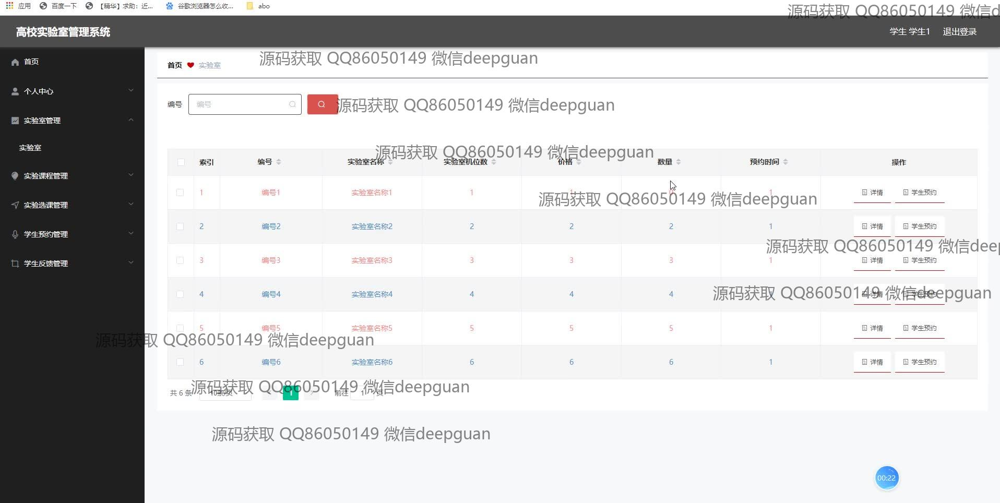
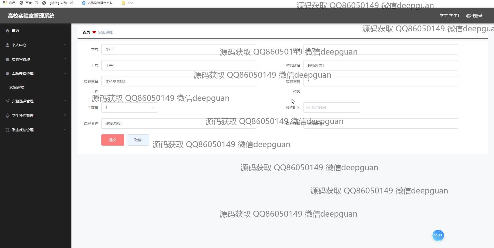
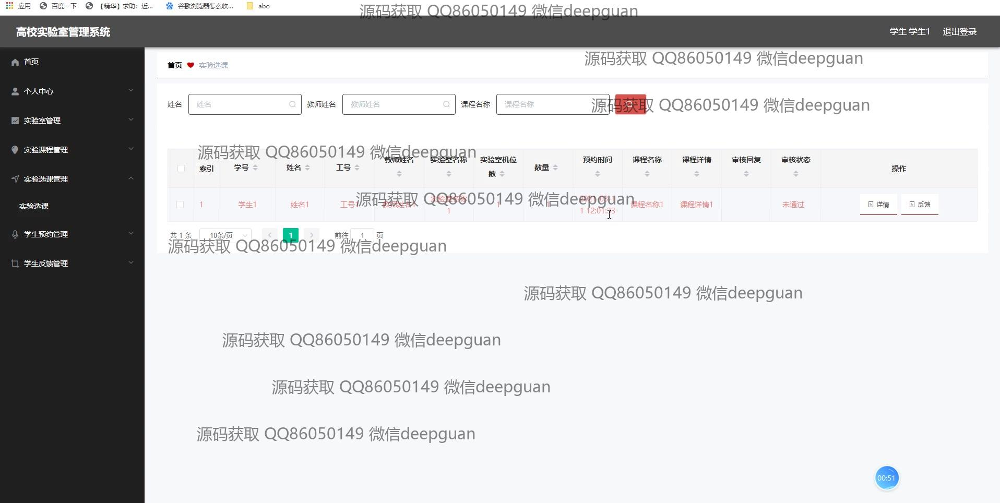
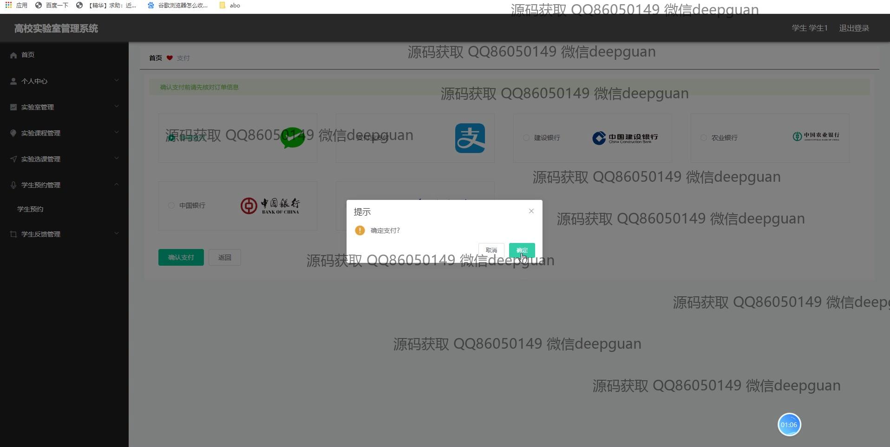
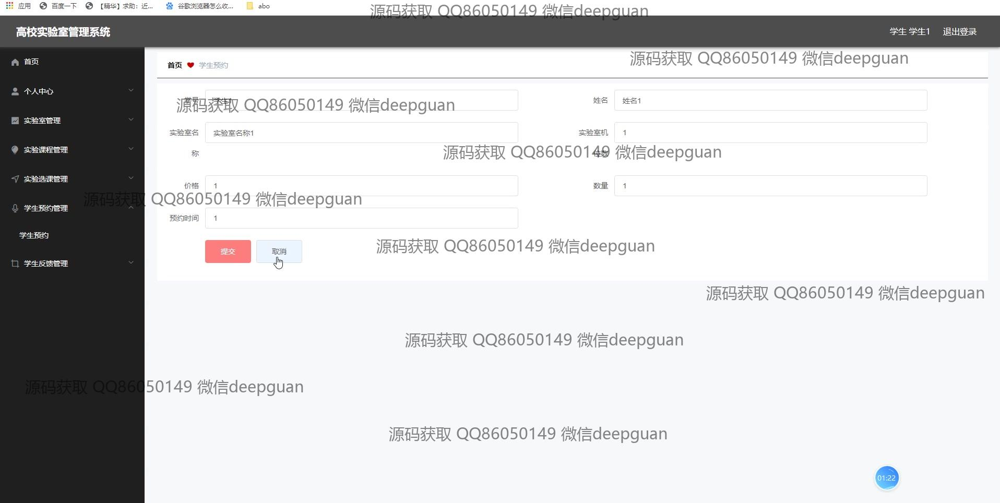

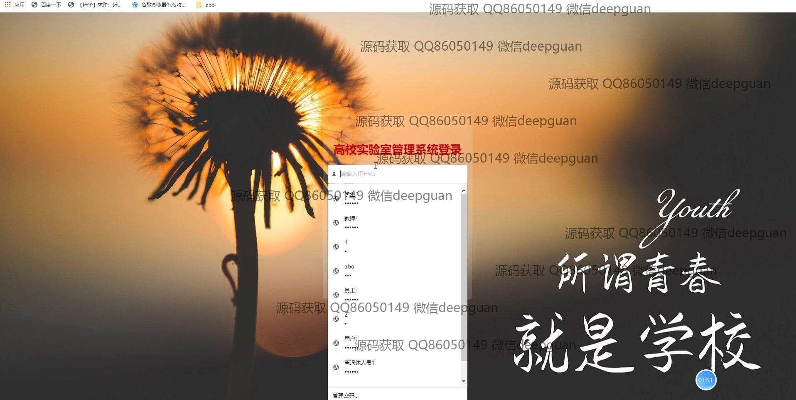
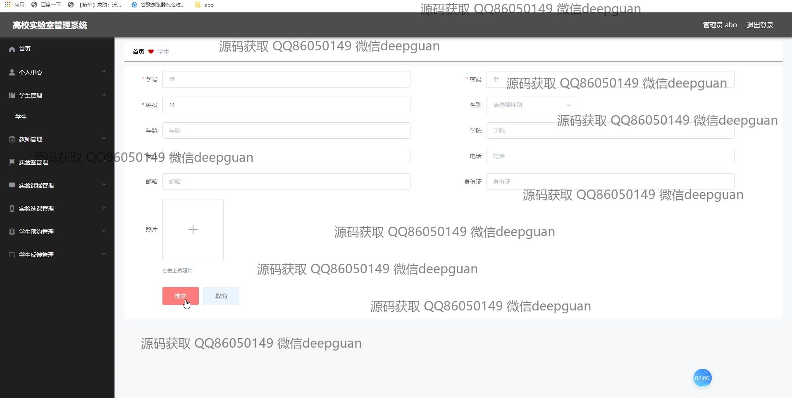
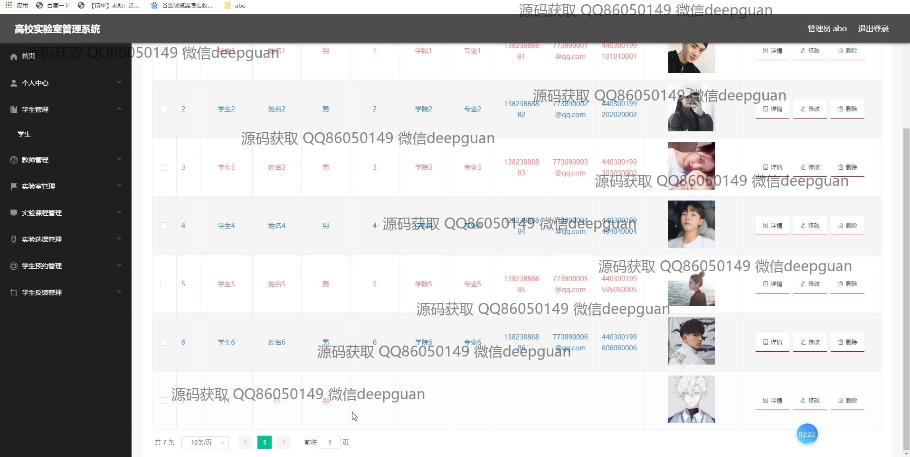
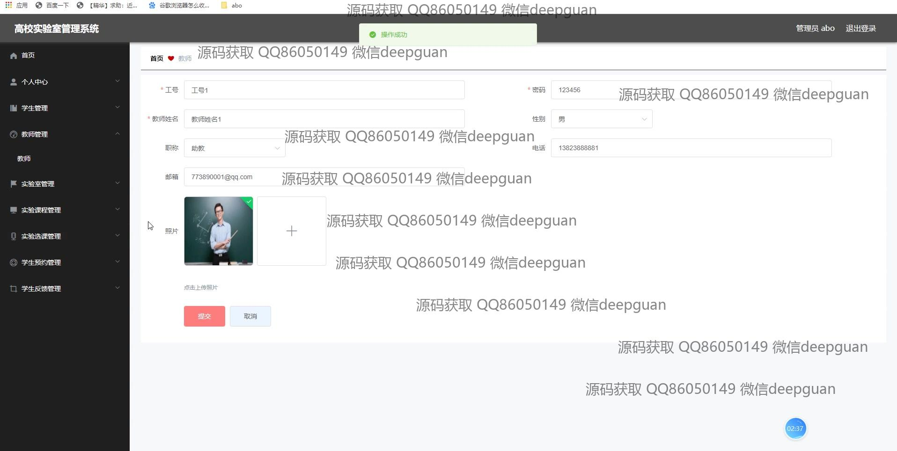
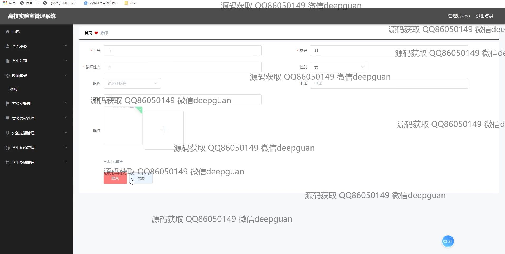
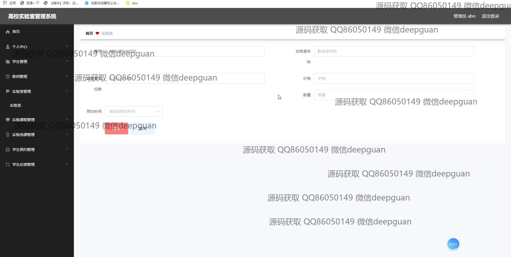
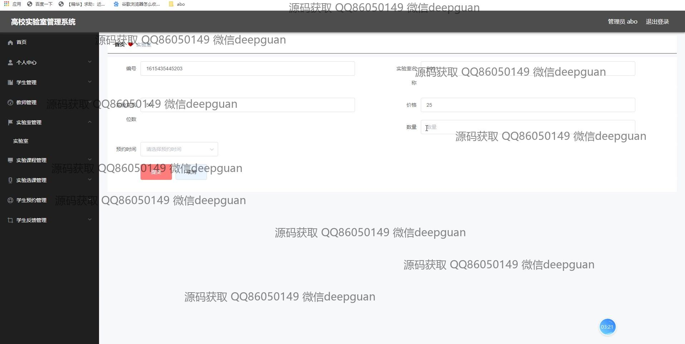
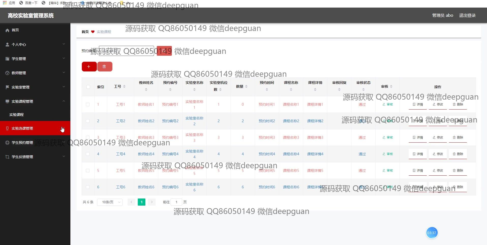
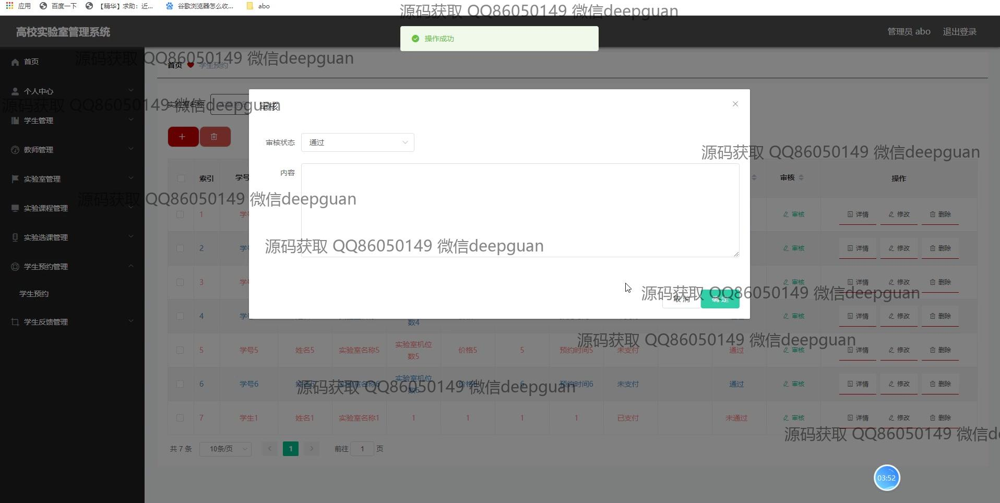
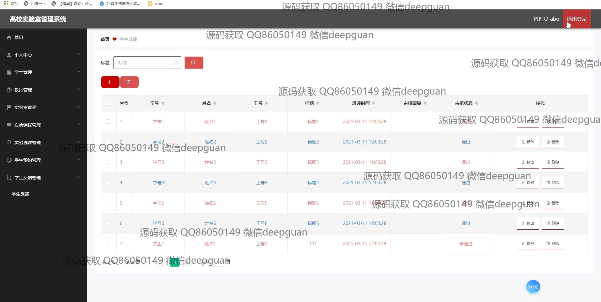
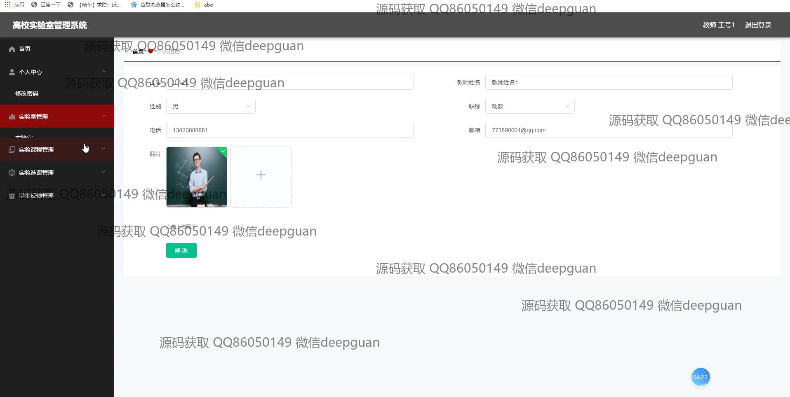
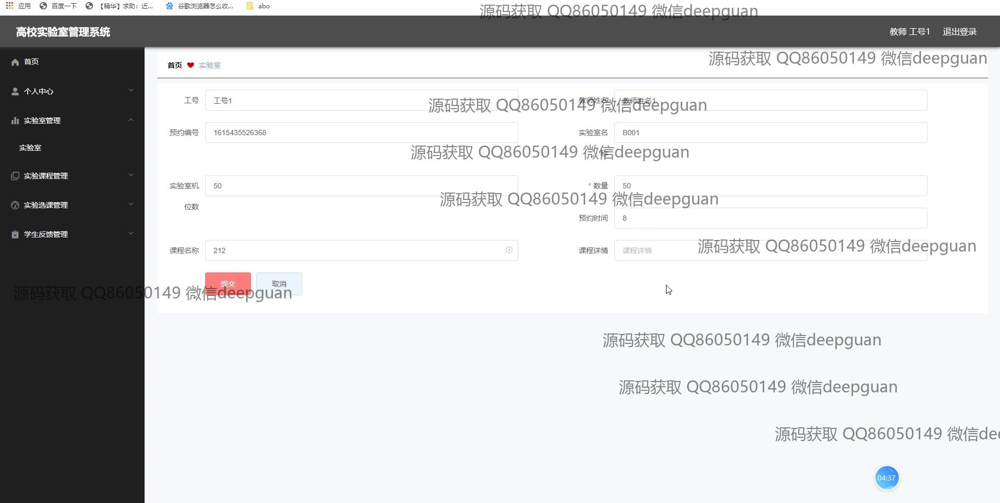
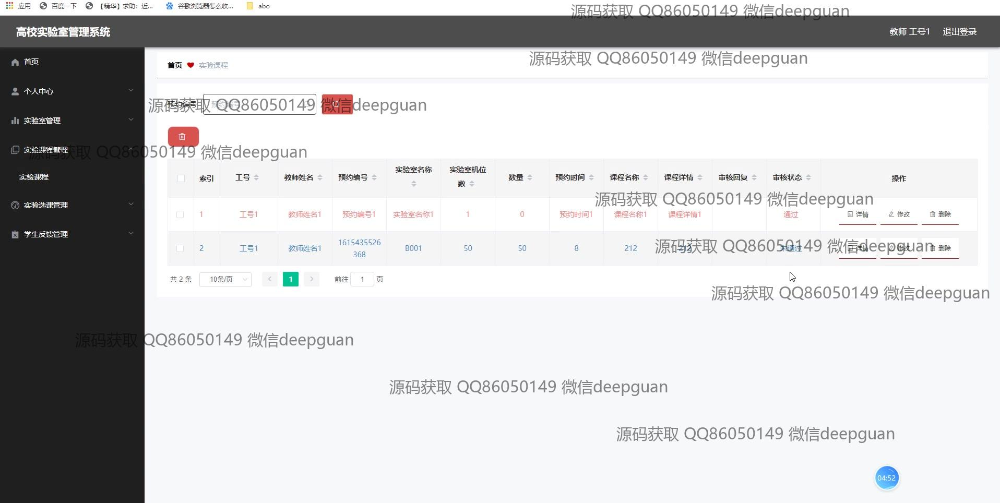
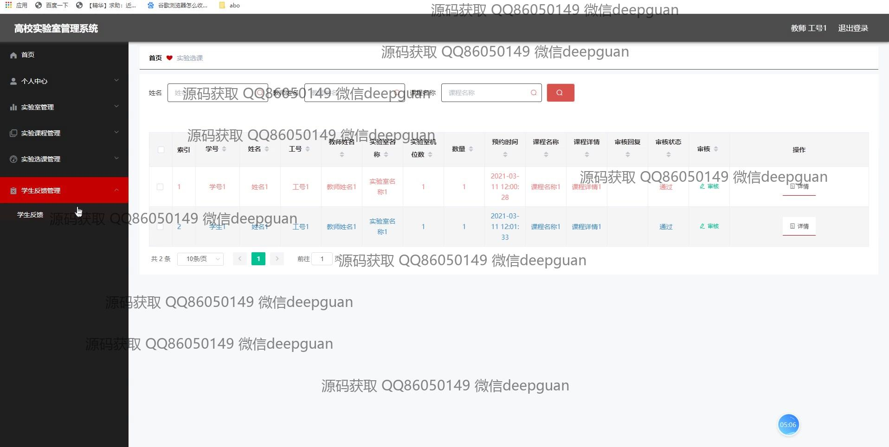
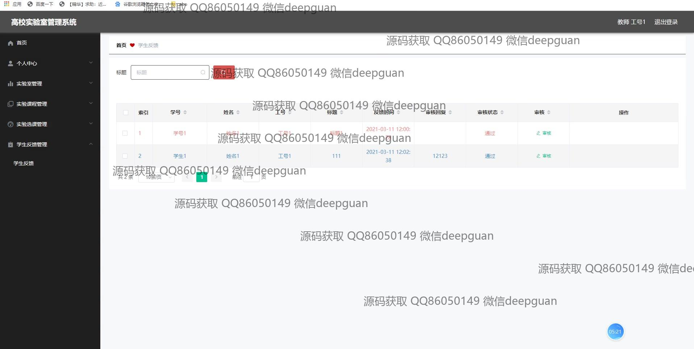
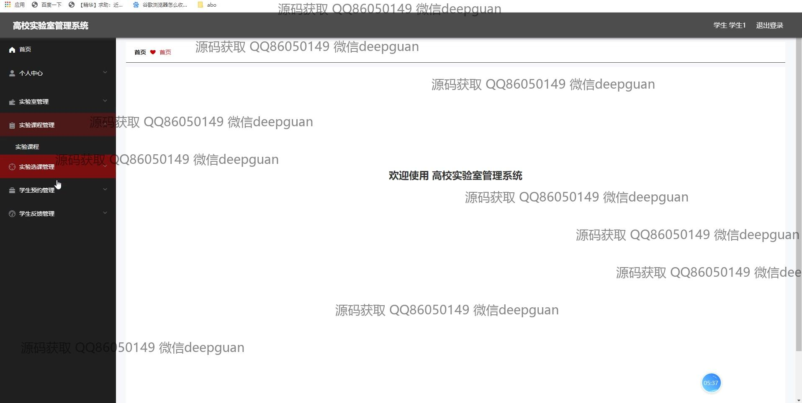

本代码来源于网络,仅供学习参考使用!

